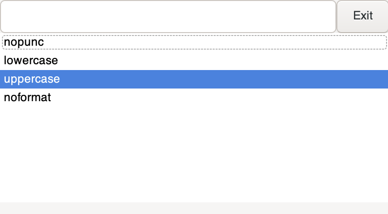
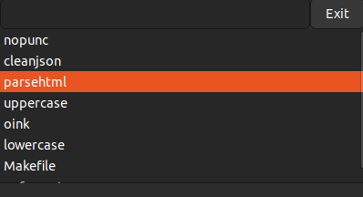

# Clipboard Transformer

The Clipboard Transformer is a simple tool that allows you to transform the text in your clipboard by running a compiled
binary
that takes your current clipboard as stdin and returns the new, transformed output over stdout.

It includes a GTK GUI that allows you to pick from a list of transformations and run them with the press of a button (or
the enter key).

| macOS                                | Ubuntu                                 |
|--------------------------------------|----------------------------------------|
|  |  |

## Installation

1. Ensure that git submodules are initialized and updated, and install gtk:

    ```bash
    git submodule update --init --recursive
    sudo apt install libgtk-3-dev
    ```
2. Build the project:

    ```bash
    cmake ./build
    cmake --build ./build
    ```
3. Install transformations: wherever the binary is, make a subdirectory called `transformations` and put compiled
   binaries inside.
4. Run the program:

    ```bash
    ./build/clipboard-transformer
    ```

## Usage

1. Copy some text to your clipboard.
2. Run the program.
3. Pick a transformation from the dropdown menu.
4. Press enter to run the transformation.
5. Paste the transformed text.
6. Repeat steps 3-5 as needed.

## Testing Transformations

Since transformations are just binaries that take stdin and return stdout, you can test them by running them directly:

```bash
$ echo "hello world" | ./transformations/uppercase
HELLO WORLD
```

On macOS, you can use `pbpaste` and `pbcopy` to test transformations on the command line using your real clipboard:

```bash
# old clipboard: hello world
$ pbpaste | ./transformations/uppercase | pbcopy
# new clipboard: HELLO WORLD
```

## Writing Transformations

Transformations are written in any language that can be compiled to a binary. The binary should take the current
clipboard
text as stdin and return the transformed text over stdout. The binary should be placed in the `transformations`
directory
in the same directory as the clipboard transformer binary.

There are some C-language examples in the `transformations` directory, but here's an example that uppercases text in a
few compiled languages:

### Golang

```go
package main

import (
	"bufio"
	"fmt"
	"os"
	"strings"
)

func main() {
	reader := bufio.NewReader(os.Stdin)
	text, _ := reader.ReadString('\n')
	text = strings.ToUpper(text)
	fmt.Print(text)
}
```

Compile with `go build -o uppercase uppercase.go`.

### C++

```cpp
#include <iostream>
#include <cctype>
#include <string>

int main() {
    std::string input;
    std::getline(std::cin, input);

    for (char& c : input) {
        c = std::toupper(c);
    }

    std::cout << input << std::endl;

    return 0;
}

```

Compile with `g++ -o uppercase uppercase.cpp`.

### Rust

```rust
#include <iostream>
#include <cctype>
#include <string>

int main() {
    std::string input;
    std::getline(std::cin, input);

    for (char& c : input) {
        c = std::toupper(c);
    }

    std::cout << input << std::endl;

    return 0;
}
```

Compile with `rustc uppercase.rs`.
